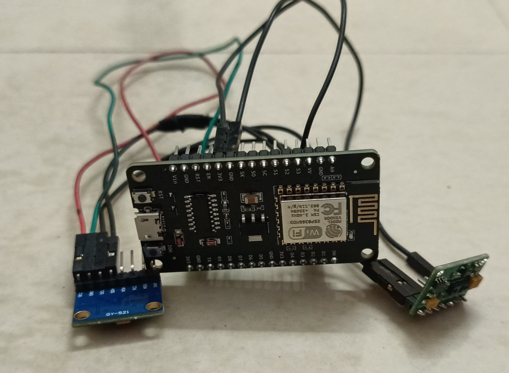
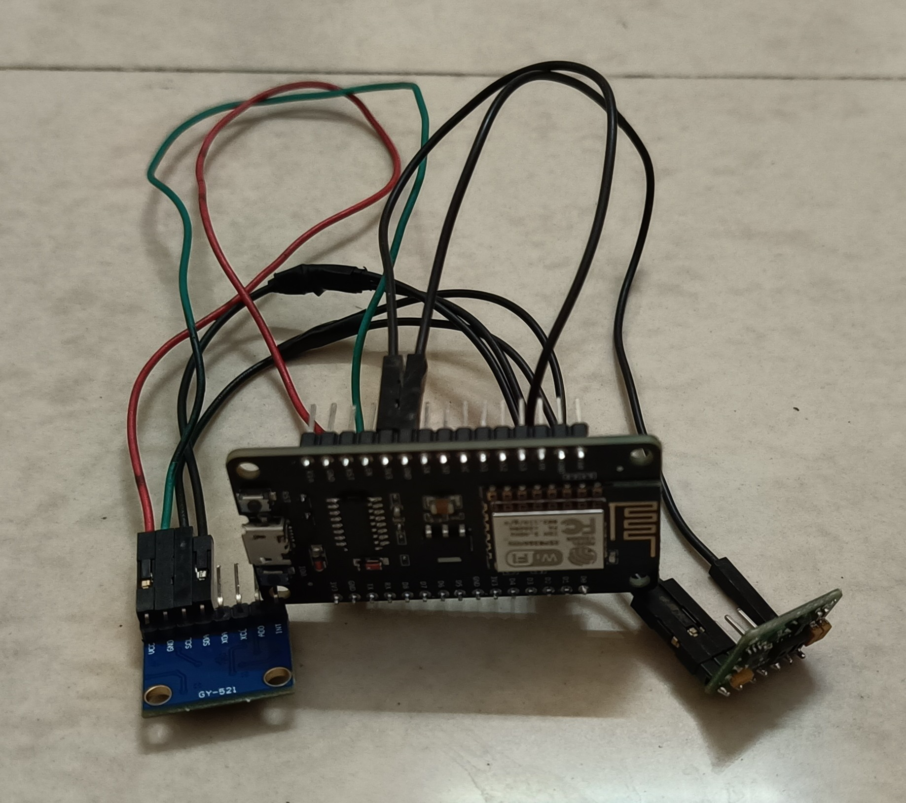

# IoT-Based Fall Detection Device

This project utilizes NodeMCU, MPU6050, and MAX30100 sensors to create a fall detection system that can send real-time notifications via text message when a fall is detected. This device is designed to monitor the health and safety of individuals, particularly those who may be at risk of falling, and provide immediate notifications in case of an emergency.

## Features

- **Fall Detection**: The system uses accelerometer and gyroscope data from the MPU6050 sensor to detect falls in real-time.
- **Heart Rate & SpO2 Monitoring**: The MAX30100 sensor measures heart rate and oxygen saturation levels, providing crucial health metrics.
- **Notifications**: In case of a fall, the device sends the health data via a text message to a specified phone number using an API.
- **Wi-Fi Connectivity**: The device connects to a Wi-Fi network for data transmission and communication.

## Components

- NodeMCU (ESP8266) board (Wifi Enabed)
- MPU6050 accelerometer and gyroscope sensor
- MAX30100 pulse oximeter sensor
- Power supply (USB or battery)

## Getting Started

1. **Hardware Setup**:
    - Connect the MPU6050 and MAX30100 sensors to the NodeMCU board.
    - Ensure a stable power supply is provided.
2. **Software Setup**:
    - Clone this repository.
    - Install the required Arduino libraries:
        - `ESP8266WiFi`
        - `Wire`
        - `MAX30100_PulseOximeter`
    - Update the `ssid` and `pass` variables in the code with your Wi-Fi network details.
    - Update the `privateKey` variable with your IFTTT API key.
3. **Uploading Code**:
    - Open the project code in Arduino IDE.
    - Select the correct board and port from the Tools menu.
    - Upload the code to the NodeMCU board.
4. **Usage**:
    - Once the device is set up, it will monitor for falls and send notifications when a fall is detected.
    - The health data (heart rate and SpO2) will be sent via text message using an API.
  
## Media

    
    

## Contributing

Contributions are welcome! Please fork the repository, make your changes, and submit a pull request.

## Author

- Abhishek Rajput
